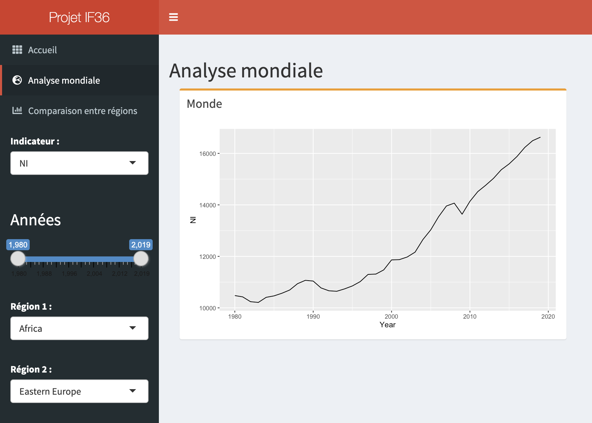
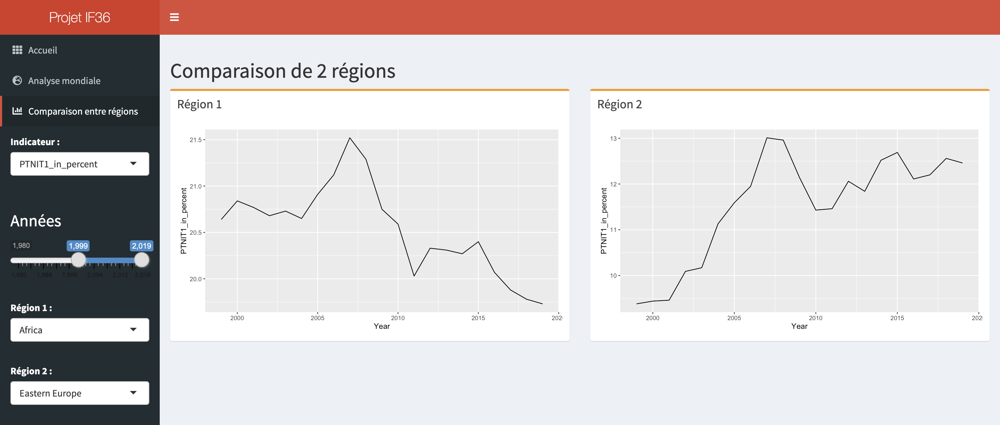
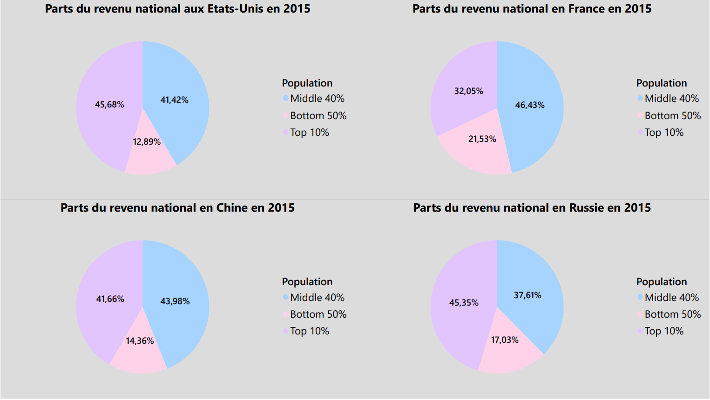
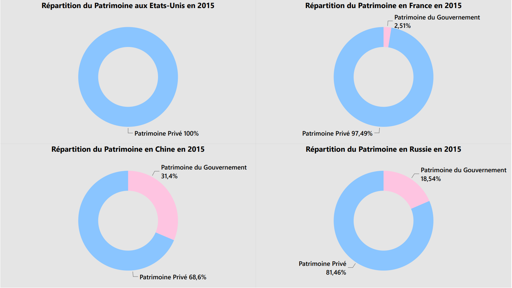

```{r setup, include=FALSE}
knitr::opts_chunk$set(echo = TRUE)
```

***

## Sommaire 

- [Introduction](#introduction)
  1. [Présentation des données](#présentation-des-données)
  2. [Plan d'analyse](#plan-d'analyse)

- [Exploration](#exploration)
  1. [Prétraitement](#prétraitement)
  2. [Analyse des inégalités selon les régions du monde](#analyse-des-inégalités-selon-les-régions-du-monde)
  3. [Analyse au niveau des pays et causes potentielles](#analyse-au-niveau-des-pays-et-causes-potentielles)
  4. [Comparaison France/USA](#comparaison-france/usa)

- [Conclusion](#conclusion)
  1. [Ce qu'on a appris des données](#ce-qu'on-a-appris-des-données)
  2. [Les difficultés rencontrées](#les-difficultés-rencontrées)
  3. [Expérience avec PowerBI](#Expérience avec PowerBI)
  4. [Retours d'expérience](#retours-d'expérience)

***

# Introduction

Après avoir effectué nos recherches de datasets chacun de notre côté et comparé nos centres d'intéret, nous nous sommes arrêté sur un sujet : les inégalités dans le monde.
Nous allons présenter ici les données choisies et notre plan d'analyse.

***

## Présentation des données 

#### World Inequality Database

Les données correspondent à une combinaison de plusieurs sources de données sur les inégalités dans le monde : comptes nationaux, enquêtes, données fiscales et classements de richesse. D'après les chercheurs à l'origine de ce dataset, cela permet d'avoir un suivi de l'évolution plus précis et à tous les niveaux des richesses dans le monde.

Les données sont accessibles sur le site [WID](https://wid.world/data/).

#### Le dataset complet
Le dataset complet est composé de nombreux fichiers.

Le fichier WID_countries.csv qui contient 5 variables et 346 observations (une par pays) :

* alpha2: le code à 2 lettres du pays/région

* titlename: le nom du pays/région

* shortname: le nom du pays/région (plus court)

* region: région du monde à laquelle le pays appartient

* region2: région plus précise du monde à laquelle le pays appartient

Les fichers WID_data_XX.csv pour chaque pays qui contiennent chacun 7 variables et un nombre d'observations très variable en fonction des pays:

* country: code pays/region (voir WID_countries.csv)

* variable: WID code pour les variables (détaillé plus loin)

* percentile: WID code pour les pourcentages (détaillé plus loin)

* year: l'année de cette donnée (de 1800 à 2019)

* value: la valeur de cette donnée

* age: code indiquant le groupe d'âge auquel la donnée fait référence

* pop: code indiquant l'unité de population auquel la donnée fait référence

Les fichiers WID_metadata_XX.csv qui contiennent chacun 17 variables précisant pour chaque fichier des descriptions précises de chaque variable du dataset,l'unité, la source et la méthode utilisée pour chaque observation.

La signification de chaque variable est donc décrite dans les fichers metadata. Le code WID pour les variables répond à la logique suivante:

* la première lettre indique le type de variable (ex: "s" pour share)

* les 5 lettres suivantes indiquent le type revenu/richesse/autre (ex: "ptinc" pour pre-tax national income)

* les 3 nombres suivants indiquent le groupe d'âge (ex: "992" pour adultes)

* la dernière lettre indique l'unité de population 

Il y a 2 types de pourcentages utilisés par WID.world : (1) pourcentages de groupe et (2) pourcentages généraux. L'interprétation du revenu (ou richesse) va dépendre de ces pourcentages.

Les pourcentages de groupe sont définis ainsi : p0p50 (bottom 50% of the population), p50p90 (next 40%), p90p100 (top 10%), p99p100 (top 1%), p0p10 (bottom 10% of the population, i.e. first decile), p10p20 (next 10%, i.e. second decile), p20p30 (next 10%, i.e. third decile), p30p40 (next 10%, i.e. fourth decile), p40p50 (next 10%, i.e. fifth decile), p50p60 (next 10%, i.e. sixth decile), p60p70 (next 10%, i.e. seventh decile), p70p80 (next 10%, i.e. eighth decile), p80p90 (next 10%, i.e. ninth decile), p0p90 (bottom 90%), p0p99 (bottom 99% of the population), p99.9p100 (top 0.1%), p99.99p100 (top 0.01%).

Les pourcentages généraux sont définis ainsi: p0, p1, p2, ..., p99.99, p99.991, p99.992 ,..., p99.999. Il y a 197 pourcentages au total.

#### Le dataset prétraité
Comme on peut le constater, le dataset complet contient beaucoup de données très précises mais difficiles à analyser sans prétraitement.

Cependant WID.world met à disposition un outil permettant d'obtenir des datasets personnalisés en choisissant les variables, pays/région ou années qui nous intéressent.
Nous avons testé cet outil avec un premier dataset contenant toutes les données sur la France.

### Les variables

Les principales variables par pays et par année sont :

**Per adult national income** (Decimal) : Le revenu national vise à mesurer le revenu total dont disposent les résidents d'un pays donné. Il est égal au produit intérieur brut, moins le capital fixe utilisé dans les processus de production, plus le revenu étranger net gagné par les résidents dans le reste du monde. L'économie nationale - au sens de la comptabilité nationale - comprend tous les secteurs domestiques, c'est-à-dire toutes les entités qui résident dans un pays donné (au sens de leur activité économique), qu'elles appartiennent au secteur privé, au secteur des entreprises, au secteur des administrations publiques. La population est composée des individus âgés de plus de 20 ans. L'unité de base est l'individu (plutôt que le ménage). Cela revient à supposer qu'il n'y a pas de partage des ressources au sein des couples.

**Per adult GDP** (Decimal) : Le produit intérieur brut est la valeur totale des biens et services produits par l'économie nationale. L'économie nationale - au sens de la comptabilité nationale - comprend tous les secteurs intérieurs, c'est-à-dire toutes les entités qui résident dans un pays donné (au sens de leur activité économique), qu'elles appartiennent au secteur privé, au secteur des entreprises, au secteur des administrations publiques. La population est composée des individus âgés de plus de 20 ans. L'unité de base est l'individu (plutôt que le ménage). Cela revient à supposer qu'il n'y a pas de partage des ressources au sein des couples.

**Income Inequality** (Decimal) : Le revenu national avant impôt est la somme de tous les flux de revenu personnel avant impôt revenant aux propriétaires des moyens de production, à savoir le travail et le capital, avant de prendre en compte le fonctionnement du système d'imposition/transfert, mais après avoir pris en compte le fonctionnement du système de retraite. La différence centrale entre le revenu personnel des facteurs et le revenu avant impôt est le traitement des pensions, qui sont comptabilisées sur une base de contribution par source de revenu et sur une base de distribution par le revenu avant impôt. La population est constituée des individus âgés de plus de 20 ans. L'unité de base est l'unité fiscale définie par les administrations fiscales nationales pour mesurer l'impôt sur le revenu des personnes physiques.

- Top 10% share : Part des 10% supérieurs
- Middle 40% share : Part des 40% du milieu
- Bottom 50% share : Part des 50% inférieurs 
- Top 1% share : Part des 1% supérieurs

**Per adult national wealth** (Decimal) : La richesse nationale nette est la valeur totale des actifs (liquidités, logements, obligations, actions, etc.) détenus par l'économie nationale, moins ses dettes. L'économie nationale - au sens de la comptabilité nationale - comprend tous les secteurs domestiques, c'est-à-dire toutes les entités qui résident dans un pays donné (au sens de leur activité économique), qu'elles appartiennent au secteur privé, au secteur des entreprises, au secteur des administrations publiques. La population est composée des individus âgés de plus de 20 ans. L'unité de base est l'individu (plutôt que le ménage). Cela revient à supposer qu'il n'y a pas de partage des ressources au sein des couples.

**Wealth-income ratio** (Decimal) : Le rapport richesse-revenu est la division de la richesse nationale par le revenu national.

**Wealth Inequality** (Decimal) : Le patrimoine personnel net est la valeur totale des actifs non financiers et financiers (logement, terrains, dépôts, obligations, actions, etc.) détenus par les ménages, moins leurs dettes. Le secteur des particuliers ou des ménages - au sens de la comptabilité nationale - comprend tous les ménages et les particuliers (y compris ceux vivant en institution), ainsi que les entreprises non constituées en société dont les comptes ne sont pas séparés de ceux des ménages qui les possèdent. La population est composée des individus âgés de plus de 20 ans. L'unité de base est l'individu (plutôt que le ménage) mais les ressources sont réparties de manière égale au sein des couples.

- Top 10% share : Part des 10% supérieurs
- Middle 40% share : Part des 40% du milieu
- Bottom 50% share : Part des 50% inférieurs 
- Top 1% share : Part des 1% supérieurs

### Un exemple de données (Pour la France)

**Year** (Année étudiée) : 2014

1. **Per adult national income** : 206741.8612 (EUR)
2. **Per adult GDP** : 40031.5172 (EUR)
3. **Income Inequality** (Top 10% share) : 0.3109 (part)
4. **Income Inequality** (Middle 40% share) : 0.4649 (part)
5. **Income Inequality** (Bottom 50% share) : 0.2243 (part)
6. **Income Inequality** (Top 1% share) : 0.0925 (part)
7. **Per adult national wealth** : 35541.7993 (EUR)
8. **Wealth-income ratio** : 5.8168702126 (ratio)
9. **Wealth Inequality** (Top 10% share) : 0.5528 (part)
10. **Wealth Inequality** (Middle 40% share) : 0.3838 (part)
11. **Wealth Inequality** (Bottom 50% share) : 0.0634 (part)
12. **Wealth Inequality** (Top 1% share) : 0.2338 (part)


## Plan d'analyse 
***

### Nos interrogations générales
* Y a-t-il une classe sociale parmis laquelle les inégalités de richesse et de revenus sont plus présentes ?
* Quels sont les pays qui comportent le moins/le plus d'inégalités parmi leur population ?
* Y a-t-il des régions du monde où les inégalités sont globalement plus/moins présentes que les autres ?
* Quels sont les pays qui ont le meilleur/le pire rapport richesse-revenu ?
* Y a-t-il une similitude entre les pays qui comportent le plus/le moins d'inégalités ?
* Certains pays ont-ils connu une augmentation/diminution significative de leurs richesses et leurs revenus ? 
* Certains pays ont-ils connu une baisse/une hausse conséquente des inégalités d'une certaine classe sociale ? Si oui, pourquoi ?
* D'une manière générale, comment ont évolué les inégalités et les richesses dans le monde depuis 1800 ? Voit-on des augmentations importantes aux années correspondantes aux révolution industrielles ?
* Comment les richesses des pays ont-elles évolués entre 1800 et 1900 ?
* Comment les richesses des pays ont-elles évolués entre 1900 et 2000 ?
* Comment les richesses des pays ont-elles évolués entre 2000 et 2019 ?

### Les interrogations en comparant plusieurs variables
* Comment évolue la corrélation entre les revenus des populations du monde (income) avec leur richesse (wealth) ?
* A quel degré sont corrélés ces deux indicateurs en fonction des groupes de populations sélectionnés ?
* Comment peut-on interpréter le PIB et le revenu national et comment évolue leur lien ?
* En choisissant deux pays diamétralement opposés sur UN critère, quelle est leur situation sur d'autres critères ?
* En ajoutant d'autres variables tel que la taille de la population, la part de la population salariée etc, comment interpréter les résultats de la confrontation avec les richesses du pays etc.

### Limites du dataset 
Notre dataset se résume à des données concernant les richesses et les revenus des populations du monde. Cependant, les inégalités se mesurent au moyen de nombreux autres facteurs de conditions de vie. Parmis elles, nous pouvont citer l'accès à l'eau potable, à l'alimentation, à l'éducation, à la santé, au logement et aux nouvelles technologies.
L'Indice de Développement Humain (IDH) mesure ces facteurs, et il pourrait être intéressant de le confronter aux indicateurs présents dans notre dataset, toujours dans le cadre de nos recherches sur les inégalités dans le monde. En effet, pays riche n'est pas toujours synonyme de pays développé.
Enfin, il faudra savoir tirer des conclusions quant aux causes de ces inégalités, qui peuvent être de natures différentes que celles exposées dans notre dataset : raisons historiques, environnementales, politiques etc.

***

# Exploration

## Prétraitement

### Import des library

Pour réaliser ce projet de visualisation de données avec R nous avons utilisé l'ensemble de librairies du 'tidyverse', 'reshape2', 'knitr' ainsi que 'ggthemes' pour améliorer l'esthétique des graphes.

```{r message = FALSE}

library(tidyverse)
library(reshape2)
library(ggthemes)
library(knitr)

```

### Import des données

Notre objectif initial était de traiter les données au niveau de chaque grande région du monde, cependant certains indicateurs sont disponibles uniquement au niveau des pays. Nous avons donc décidé d'utiliser 2 datasets différents afin de pouvoir réaliser un maximum de visualisations intéressantes.

L'outil de création de datasets personnalisés proposé par le site permet d'utiliser seulement 5 indicateurs par datasets.
Donc pour les 2 datasets nous avons dû télécharger les données par morceaux et les agréer ensemble par la suite.

```{r message = FALSE, warning=FALSE}

#Importation des datasets dans R

world_region_data <- read_delim("data/World_Region_Data/world_region_data.csv", 
    ";", escape_double = FALSE, trim_ws = TRUE)

world_region_data2 <- read_delim("data/World_Region_Data/world_region_data2.csv", 
    ";", escape_double = FALSE, trim_ws = TRUE)

world_country_data1 <- read_delim("data/World_Country_Data/world_country_data1.csv", 
    ";", escape_double = FALSE, trim_ws = TRUE)

world_country_data2 <- read_delim("data/World_Country_Data/world_country_data2.csv", 
    ";", escape_double = FALSE, trim_ws = TRUE)

world_country_data3 <- read_delim("data/World_Country_Data/world_country_data3.csv", 
    ";", escape_double = FALSE, trim_ws = TRUE)

```

### Agrégation des datasets

```{r}
#Agrégation des datasets

region_dataset <- merge(x = world_region_data, y = world_region_data2, by = "Year", all = TRUE)
region_dataset <- data.frame(region_dataset)
region_dataset <- tibble(region_dataset)
rm(world_region_data,world_region_data2)

country_dataset <- merge(x = world_country_data1, y = world_country_data2, by = "Year", all = TRUE)
country_dataset <- merge(x = country_dataset, y = world_country_data3, by = "Year", all = TRUE)
country_dataset <- data.frame(country_dataset)
country_dataset <- tibble(country_dataset)

```

### Création de sous-datasets pour séparer les données par indicateurs

Afin de faciliter le travail de création de visualisations nous avons réalisé que nous devions changer le format de nos données.
En effet nous voulions avoir en paramètre les indicateurs sans les régions/pays où ils ont été mesurés et avoir ainsi tous les pays/régions dans une colonne à part entière.
Pour ce faire un gros travail de prétraitement est nécessaire.
On extrait tout d'abord chaque indicateur dans un dataframe propre.

```{r}

#Création d'un dataset pour chaque indicateur

NIdataset <- region_dataset %>% select("Year", ends_with("NI"))
GDPdataset <- region_dataset %>% select("Year", ends_with("GDP"))
PTNIB40dataset <- region_dataset %>% select("Year", ends_with("PTNIB40"))
PTNIB50dataset <- region_dataset %>% select("Year", ends_with("PTNIB50"))
PTNIT1dataset <- region_dataset %>% select("Year", ends_with("PTNIT1"))
PTNIT10dataset <- region_dataset %>% select("Year", ends_with("PTNIT10"))
PTNIM40dataset <- region_dataset %>% select("Year", ends_with("PTNIM40"))
rm(region_dataset)

PatGouvdataset <- world_country_data1 %>% select("Year", ends_with("PatrimoineGouvernement"))
PatPrivdataset <- world_country_data1 %>% select("Year", ends_with("PatrimoinePrivé"))
PIBdataset <- world_country_data1 %>% select("Year", ends_with("PIB"))
RatioPatRevdataset <- world_country_data1 %>% select("Year", ends_with("RatioPatrimoineRevenu"))
RevNatdataset <- world_country_data2 %>% select("Year", ends_with("RevenuNational"))
RevNatTop10dataset <- world_country_data2 %>% select("Year", ends_with("RevenuNationalPT(Top10%)"))
RevNatBottom50dataset <- world_country_data2 %>% select("Year", ends_with("RevenuNationalPT(Bottom50%)"))
RevNatTop1dataset <- world_country_data2 %>% select("Year", ends_with("RevenuNationalPT(Top1%)"))
RevNatMedium40dataset <- world_country_data2 %>% select("Year", ends_with("RevenuNationalPT(Medium40%)"))
CapNatdataset <- world_country_data3 %>% select("Year", ends_with("CapitalNational"))
PatTop10 <- country_dataset %>% select("Year", ends_with("Patrimoine.Top10.."))
PatMedium40 <- country_dataset %>% select("Year", ends_with("Patrimoine.Medium40.."))
PatBottom50 <- country_dataset %>% select("Year", ends_with("Patrimoine.Bottom50.."))
PatTop1 <- country_dataset %>% select("Year", ends_with("Patrimoine.Top1.."))
rm(country_dataset,world_country_data1,world_country_data2,world_country_data3)

```

On vient ensuite regrouper chaque observation par régions/pays et appliquer des transformations aux variables pour les rendre plus lisibles.  

```{r}

#Renommer les variables, changer de format le dataset (création d'une colonne "Année", une colonne "variable" (=Pays) et une colonne "value", que l'on transforme en pourcentage)

tempdataset <- PTNIT10dataset %>% rename("World"=WorldPTNIT10,"Western Europe"=WesternEuropePTNIT10, Asia=AsiaPTNIT10, "Eastern Europe"=EasternEuropePTNIT10, "Northern America"=NorthernAmericaPTNIT10, Oceania=OceaniaPTNIT10, "Latin America"=LatinAmericaPTNIT10, Africa=AfricaPTNIT10) %>%
melt(id.vars="Year") %>%
filter(variable=="World"|variable=="Western Europe"|variable=="Asia"|variable=="Eastern Europe"|variable=="Northern America"|variable=="Oceania"|variable=="Latin America"|variable=="Africa")%>%
mutate(PTNIT10_in_percent = value*100)%>%
subset (select = -value)

tempdataset2 <- PTNIM40dataset %>% rename("World"=WorldPTNIM40,"Western Europe"=WesternEuropePTNIM40, Asia=AsiaPTNIM40, "Eastern Europe"=EasternEuropePTNIM40, "Northern America"=NorthernAmericaPTNIM40, Oceania=OceaniaPTNIM40, "Latin America"=LatinAmericaPTNIM40, Africa=AfricaPTNIM40) %>%
melt(id.vars="Year") %>%
filter(variable=="World"|variable=="Western Europe"|variable=="Asia"|variable=="Eastern Europe"|variable=="Northern America"|variable=="Oceania"|variable=="Latin America"|variable=="Africa") %>%
mutate(PTNIM40_in_percent = value*100)%>%
subset (select = -value)


tempdataset3 <- PTNIB50dataset %>% rename("World"=WorldPTNIB50,"Western Europe"=WesternEuropePTNIB50, Asia=AsiaPTNIB50, "Eastern Europe"=EasternEuropePTNIB50, "Northern America"=NorthernAmericaPTNIB50, Oceania=OceaniaPTNIB50, "Latin America"=LatinAmericaPTNIB50, Africa=AfricaPTNIB50) %>%
melt(id.vars="Year") %>%
filter(variable=="World"|variable=="Western Europe"|variable=="Asia"|variable=="Eastern Europe"|variable=="Northern America"|variable=="Oceania"|variable=="Latin America"|variable=="Africa") %>%
mutate(PTNIB50_in_percent = value*100)%>%
subset (select = -value)

tempdataset4 <- PTNIT1dataset %>% rename("World"=WorldPTNIT1,"Western Europe"=WesternEuropePTNIT1, Asia=AsiaPTNIT1, "Eastern Europe"=EasternEuropePTNIT1, "Northern America"=NorthernAmericaPTNIT1, Oceania=OceaniaPTNIT1, "Latin America"=LatinAmericaPTNIT1, Africa=AfricaPTNIT1) %>%
melt(id.vars="Year") %>%
filter(variable=="World"|variable=="Western Europe"|variable=="Asia"|variable=="Eastern Europe"|variable=="Northern America"|variable=="Oceania"|variable=="Latin America"|variable=="Africa")%>%
mutate(PTNIT1_in_percent = value*100)%>%
subset (select = -value)

tempdataset5 <- NIdataset %>% rename("World"=WorldNI,"Western Europe"=WesternEuropeNI, Asia=AsiaNI, "Eastern Europe"=EasternEuropeNI, "Northern America"=NorthernAmericaNI, Oceania=OceaniaNI, "Latin America"=LatinAmericaNI, Africa=AfricaNI) %>%
melt(id.vars="Year") %>%
filter(variable=="World"|variable=="Western Europe"|variable=="Asia"|variable=="Eastern Europe"|variable=="Northern America"|variable=="Oceania"|variable=="Latin America"|variable=="Africa")%>%
rename(NI=value)

tempdataset6 <- GDPdataset %>% rename("World"=WorldGDP,"Western Europe"=WesternEuropeGDP, Asia=AsiaGDP, "Eastern Europe"=EasternEuropeGDP, "Northern America"=NorthernAmericaGDP, Oceania=OceaniaGDP, "Latin America"=LatinAmericaGDP, Africa=AfricaGDP) %>%
melt(id.vars="Year") %>%
filter(variable=="World"|variable=="Western Europe"|variable=="Asia"|variable=="Eastern Europe"|variable=="Northern America"|variable=="Oceania"|variable=="Latin America"|variable=="Africa")%>%
rename(GDP=value)

```

On merge ensuite tous les indicateurs dans un seul dataset.

```{r}

#Création du dataset final pour les régions (merge de tous les autres avec la variable "Année")

final_region_dataset <- merge(x = tempdataset, y = tempdataset2, by = c("Year", "variable"), all = TRUE)
final_region_dataset <- merge(x = final_region_dataset, y = tempdataset3, by = c("Year", "variable"), all = TRUE)
final_region_dataset <- merge(x = final_region_dataset, y = tempdataset4, by = c("Year", "variable"), all = TRUE)
final_region_dataset <- merge(x = final_region_dataset, y = tempdataset5, by = c("Year", "variable"), all = TRUE)
final_region_dataset <- merge(x = final_region_dataset, y = tempdataset6, by = c("Year", "variable"), all = TRUE)%>%
    
#On renomme la colomne "variable" avec "Region"
    
rename(Region=variable)

#On supprime les datasets intermédiaires

rm(tempdataset, tempdataset2, tempdataset3,tempdataset4,tempdataset5,tempdataset6)
rm(NIdataset,GDPdataset,PTNIT1dataset,PTNIT10dataset,PTNIM40dataset,PTNIB50dataset,PTNIB40dataset)

```

On fait de même pour le dataset par pays.

```{r}

#Renommer les variables, changer de format le dataset (création d'une colonne "Year", une colonne "variable" (=Pays) et une colonne "value", que l'on renomme par le nom de l'indicateur en question)

tempdataset <- PatGouvdataset %>% rename("France"=France_PatrimoineGouvernement,"Afrique du Sud"=AfriqueSud_PatrimoineGouvernement, "Australie"=Australie_PatrimoineGouvernement, "Canada"=Canada_PatrimoineGouvernement, "Chine"=Chine_PatrimoineGouvernement, "Danemark"=Danemark_PatrimoineGouvernement, "Inde"=Inde_PatrimoineGouvernement, "Royaume-Uni"=RU_PatrimoineGouvernement, "Japon"=Japon_PatrimoineGouvernement, "Mexique"=Mexique_PatrimoineGouvernement, "Russie"=Russie_PatrimoineGouvernement, "Etats-Unis"=US_PatrimoineGouvernement) %>%
melt(id.vars="Year") %>%
mutate(PatrimoineGouvernement = value)%>%
subset (select = -value)

tempdataset2 <- PatPrivdataset %>% rename("France"=France_PatrimoinePrivé,"Afrique du Sud"=AfriqueSud_PatrimoinePrivé, "Australie"=Australie_PatrimoinePrivé, "Canada"=Canada_PatrimoinePrivé, "Chine"=Chine_PatrimoinePrivé, "Danemark"=Danemark_PatrimoinePrivé, "Inde"=Inde_PatrimoinePrivé, "Royaume-Uni"=RU_PatrimoinePrivé, "Japon"=Japon_PatrimoinePrivé, "Mexique"=Mexique_PatrimoinePrivé, "Russie"=Russie_PatrimoinePrivé, "Etats-Unis"=US_PatrimoinePrivé) %>%
melt(id.vars="Year") %>%
mutate(PatrimoinePrivé = value)%>%
subset (select = -value)

tempdataset3 <- PIBdataset %>% rename("France"=France_PIB,"Afrique du Sud"=AfriqueSud_PIB, "Australie"=Australie_PIB, "Canada"=Canada_PIB, "Chine"=Chine_PIB, "Danemark"=Danemark_PIB, "Inde"=Inde_PIB, "Royaume-Uni"=RU_PIB, "Japon"=Japon_PIB, "Mexique"=Mexique_PIB, "Russie"=Russie_PIB, "Etats-Unis"=US_PIB) %>%
melt(id.vars="Year") %>%
mutate(PIB = value)%>%
subset (select = -value)

tempdataset4 <- RatioPatRevdataset %>% rename("France"=France_RatioPatrimoineRevenu,"Afrique du Sud"=AfriqueSud_RatioPatrimoineRevenu, "Australie"=Australie_RatioPatrimoineRevenu, "Canada"=Canada_RatioPatrimoineRevenu, "Chine"=Chine_RatioPatrimoineRevenu, "Danemark"=Danemark_RatioPatrimoineRevenu, "Inde"=Inde_RatioPatrimoineRevenu, "Royaume-Uni"=RU_RatioPatrimoineRevenu, "Japon"=Japon_RatioPatrimoineRevenu, "Mexique"=Mexique_RatioPatrimoineRevenu, "Russie"=Russie_RatioPatrimoineRevenu, "Etats-Unis"=US_RatioPatrimoineRevenu) %>%
melt(id.vars="Year") %>%
mutate(RatioPatrimoineRevenu = value)%>%
subset (select = -value)

tempdataset5 <- RevNatdataset %>% rename("France"=France_RevenuNational,"Afrique du Sud"=AfriqueSud_RevenuNational, "Australie"=Australie_RevenuNational, "Canada"=Canada_RevenuNational, "Chine"=Chine_RevenuNational, "Danemark"=Danemark_RevenuNational, "Inde"=Inde_RevenuNational, "Royaume-Uni"=RU_RevenuNational, "Japon"=Japon_RevenuNational, "Mexique"=Mexique_RevenuNational, "Russie"=Russie_RevenuNational, "Etats-Unis"=US_RevenuNational) %>%
melt(id.vars="Year") %>%
mutate(RevenuNational = value)%>%
subset (select = -value)

tempdataset6 <- RevNatTop10dataset %>% rename("France"=`France_RevenuNationalPT(Top10%)`,"Afrique du Sud"=`AfriqueSud_RevenuNationalPT(Top10%)`, "Australie"=`Australie_RevenuNationalPT(Top10%)`, "Canada"=`Canada_RevenuNationalPT(Top10%)`, "Chine"=`Chine_RevenuNationalPT(Top10%)`, "Danemark"=`Danemark_RevenuNationalPT(Top10%)`, "Inde"=`Inde_RevenuNationalPT(Top10%)`, "Royaume-Uni"=`RU_RevenuNationalPT(Top10%)`, "Japon"=`Japon_RevenuNationalPT(Top10%)`, "Mexique"=`Mexique_RevenuNationalPT(Top10%)`, "Russie"=`Russie_RevenuNationalPT(Top10%)`, "Etats-Unis"=`US_RevenuNationalPT(Top10%)`) %>%
melt(id.vars="Year") %>%
mutate(RevenuNationalTop10 = value*100)%>%
subset (select = -value)

tempdataset7 <- RevNatBottom50dataset %>% rename("France"=`France_RevenuNationalPT(Bottom50%)`,"Afrique du Sud"=`AfriqueSud_RevenuNationalPT(Bottom50%)`, "Australie"=`Australie_RevenuNationalPT(Bottom50%)`, "Canada"=`Canada_RevenuNationalPT(Bottom50%)`, "Chine"=`Chine_RevenuNationalPT(Bottom50%)`, "Danemark"=`Danemark_RevenuNationalPT(Bottom50%)`, "Inde"=`Inde_RevenuNationalPT(Bottom50%)`, "Royaume-Uni"=`RU_RevenuNationalPT(Bottom50%)`, "Japon"=`Japon_RevenuNationalPT(Bottom50%)`, "Mexique"=`Mexique_RevenuNationalPT(Bottom50%)`, "Russie"=`Russie_RevenuNationalPT(Bottom50%)`, "Etats-Unis"=`US_RevenuNationalPT(Bottom50%)`) %>%
melt(id.vars="Year") %>%
mutate(RevenuNationalBottom50 = value*100)%>%
subset (select = -value)

tempdataset8 <- RevNatTop1dataset %>% rename("France"=`France_RevenuNationalPT(Top1%)`,"Afrique du Sud"=`AfriqueSud_RevenuNationalPT(Top1%)`, "Australie"=`Australie_RevenuNationalPT(Top1%)`, "Canada"=`Canada_RevenuNationalPT(Top1%)`, "Chine"=`Chine_RevenuNationalPT(Top1%)`, "Danemark"=`Danemark_RevenuNationalPT(Top1%)`, "Inde"=`Inde_RevenuNationalPT(Top1%)`, "Royaume-Uni"=`RU_RevenuNationalPT(Top1%)`, "Japon"=`Japon_RevenuNationalPT(Top1%)`, "Mexique"=`Mexique_RevenuNationalPT(Top1%)`, "Russie"=`Russie_RevenuNationalPT(Top1%)`, "Etats-Unis"=`US_RevenuNationalPT(Top1%)`) %>%
melt(id.vars="Year") %>%
mutate(RevenuNationalTop1 = value*100)%>%
subset (select = -value)

tempdataset9 <- RevNatMedium40dataset %>% rename("France"=`France_RevenuNationalPT(Medium40%)`,"Afrique du Sud"=`AfriqueSud_RevenuNationalPT(Medium40%)`, "Australie"=`Australie_RevenuNationalPT(Medium40%)`, "Canada"=`Canada_RevenuNationalPT(Medium40%)`, "Chine"=`Chine_RevenuNationalPT(Medium40%)`, "Danemark"=`Danemark_RevenuNationalPT(Medium40%)`, "Inde"=`Inde_RevenuNationalPT(Medium40%)`, "Royaume-Uni"=`RU_RevenuNationalPT(Medium40%)`, "Japon"=`Japon_RevenuNationalPT(Medium40%)`, "Mexique"=`Mexique_RevenuNationalPT(Medium40%)`, "Russie"=`Russie_RevenuNationalPT(Medium40%)`, "Etats-Unis"=`US_RevenuNationalPT(Medium40%)`) %>%
melt(id.vars="Year") %>%
mutate(RevenuNationalMedium40 = value*100)%>%
subset (select = -value)

tempdataset10 <- CapNatdataset %>% rename("France"=France_CapitalNational,"Afrique du Sud"=AfriqueSud_CapitalNational, "Australie"=Australie_CapitalNational, "Canada"=Canada_CapitalNational, "Chine"=Chine_CapitalNational, "Danemark"=Danemark_CapitalNational, "Inde"=Inde_CapitalNational, "Royaume-Uni"=RU_CapitalNational, "Japon"=Japon_CapitalNational, "Mexique"=Mexique_CapitalNational, "Russie"=Russie_CapitalNational, "Etats-Unis"=US_CapitalNational) %>%
melt(id.vars="Year") %>%
mutate(CapitalNational = value*100)%>%
subset (select = -value)

tempdataset11 <- PatTop10 %>% rename("France"=France_Patrimoine.Top10..,"Afrique du Sud"=AfriqueSud_Patrimoine.Top10.., "Australie"=Australie_Patrimoine.Top10.., "Canada"=Canada_Patrimoine.Top10.., "Chine"=Chine_Patrimoine.Top10.., "Danemark"=Danemark_Patrimoine.Top10.., "Inde"=Inde_Patrimoine.Top10.., "Royaume-Uni"=RU_Patrimoine.Top10.., "Japon"=Japon_Patrimoine.Top10.., "Mexique"=Mexique_Patrimoine.Top10.., "Russie"=Russie_Patrimoine.Top10.., "Etats-Unis"=US_Patrimoine.Top10..) %>%
melt(id.vars="Year") %>%
mutate(PatrimoineTop10 = value*100)%>%
subset (select = -value)

tempdataset12 <- PatBottom50 %>% rename("France"=France_Patrimoine.Bottom50..,"Afrique du Sud"=AfriqueSud_Patrimoine.Bottom50.., "Australie"=Australie_Patrimoine.Bottom50.., "Canada"=Canada_Patrimoine.Bottom50.., "Chine"=Chine_Patrimoine.Bottom50.., "Danemark"=Danemark_Patrimoine.Bottom50.., "Inde"=Inde_Patrimoine.Bottom50.., "Royaume-Uni"=RU_Patrimoine.Bottom50.., "Japon"=Japon_Patrimoine.Bottom50.., "Mexique"=Mexique_Patrimoine.Bottom50.., "Russie"=Russie_Patrimoine.Bottom50.., "Etats-Unis"=US_Patrimoine.Bottom50..) %>%
melt(id.vars="Year") %>%
mutate(PatrimoineBottom50 = value*100)%>%
subset (select = -value)

tempdataset13 <- PatTop1 %>% rename("France"=France_Patrimoine.Top1..,"Afrique du Sud"=AfriqueSud_Patrimoine.Top1.., "Australie"=Australie_Patrimoine.Top1.., "Canada"=Canada_Patrimoine.Top1.., "Chine"=Chine_Patrimoine.Top1.., "Danemark"=Danemark_Patrimoine.Top1.., "Inde"=Inde_Patrimoine.Top1.., "Royaume-Uni"=RU_Patrimoine.Top1.., "Japon"=Japon_Patrimoine.Top1.., "Mexique"=Mexique_Patrimoine.Top1.., "Russie"=Russie_Patrimoine.Top1.., "Etats-Unis"=US_Patrimoine.Top1..) %>%
melt(id.vars="Year") %>%
mutate(PatrimoineTop1 = value*100)%>%
subset (select = -value)

tempdataset14 <- PatMedium40 %>% rename("France"=France_Patrimoine.Medium40..,"Afrique du Sud"=AfriqueSud_Patrimoine.Medium40.., "Australie"=Australie_Patrimoine.Medium40.., "Canada"=Canada_Patrimoine.Medium40.., "Chine"=Chine_Patrimoine.Medium40.., "Danemark"=Danemark_Patrimoine.Medium40.., "Inde"=Inde_Patrimoine.Medium40.., "Royaume-Uni"=RU_Patrimoine.Medium40.., "Japon"=Japon_Patrimoine.Medium40.., "Mexique"=Mexique_Patrimoine.Medium40.., "Russie"=Russie_Patrimoine.Medium40.., "Etats-Unis"=US_Patrimoine.Medium40..) %>%
melt(id.vars="Year") %>%
mutate(PatrimoineMedium40 = value*100)%>%
subset (select = -value)

#Création du dataset final pour les pays (merge de tous les autres avec la variable "Year")

final_country_dataset <- merge(x = tempdataset, y = tempdataset2, by = c("Year", "variable"), all = TRUE)
final_country_dataset <- merge(x = final_country_dataset, y = tempdataset3, by = c("Year", "variable"), all = TRUE)
final_country_dataset <- merge(x = final_country_dataset, y = tempdataset4, by = c("Year", "variable"), all = TRUE)
final_country_dataset <- merge(x = final_country_dataset, y = tempdataset5, by = c("Year", "variable"), all = TRUE)
final_country_dataset <- merge(x = final_country_dataset, y = tempdataset6, by = c("Year", "variable"), all = TRUE)
final_country_dataset <- merge(x = final_country_dataset, y = tempdataset7, by = c("Year", "variable"), all = TRUE)
final_country_dataset <- merge(x = final_country_dataset, y = tempdataset8, by = c("Year", "variable"), all = TRUE)
final_country_dataset <- merge(x = final_country_dataset, y = tempdataset9, by = c("Year", "variable"), all = TRUE)
final_country_dataset <- merge(x = final_country_dataset, y = tempdataset10, by = c("Year", "variable"), all = TRUE)
final_country_dataset <- merge(x = final_country_dataset, y = tempdataset11, by = c("Year", "variable"), all = TRUE)
final_country_dataset <- merge(x = final_country_dataset, y = tempdataset12, by = c("Year", "variable"), all = TRUE)
final_country_dataset <- merge(x = final_country_dataset, y = tempdataset13, by = c("Year", "variable"), all = TRUE)
final_country_dataset <- merge(x = final_country_dataset, y = tempdataset14, by = c("Year", "variable"), all = TRUE)

#On renomme la colomne "variable" avec "Pays"

final_country_dataset <- final_country_dataset %>% rename(Pays=variable)

#On supprime les datasets intermédiaires

rm(tempdataset, tempdataset2, tempdataset3,tempdataset4,tempdataset5,tempdataset6,tempdataset7,tempdataset8,tempdataset9,tempdataset10,tempdataset11,tempdataset12,tempdataset13,tempdataset14)
rm(PatGouvdataset,PatPrivdataset,PIBdataset,RatioPatRevdataset,RevNatdataset,RevNatTop1dataset,RevNatTop10dataset,RevNatMedium40dataset,RevNatBottom50dataset,CapNatdataset,PatTop1,PatTop10,PatMedium40,PatBottom50)

```

### Visualisation rapide des données

Après prétraitement de nos 2 datasets on obtient les résultats suivants :

```{r error=FALSE}

kable(tail(final_region_dataset), caption = "Dataset final par régions")

```
```{r error=FALSE}

kable(tail(final_country_dataset),caption = "Dataset final par pays")

```


## Analyse des inégalités selon les régions du monde

### ShinyApp

Dans ce projet, nous avons décidé d'utiliser l'application Shiny comme un outil d'exploration de notre dataset.
Nous avons donc créé un dashboard permettant de sélectionner un indicateur du dataset ainsi qu'une période donnée et d'obtenir ainsi rapidement un graphe de l'évolution de cette variable au niveau mondial.
Par exemple, on peut ici observer que globalement au niveau mondial, le revenu national n'a cessé d'augmenter depuis 1980.



La deuxième fonctionnalité proposée par notre dashboard permet de comparer cette évolution entre deux régions du monde.
Par exemple, on peut ici observer la différence entre l'Afrique et l'Europe de l'Est quant à l'évolution de la part des 1% plus riches dans le revenu national. On constate bien ici que la tendance est à la baisse en Afrique et à la hausse en Europe de l'Est.



Grâce à notre Shiny nous pouvons rapidement nous rendre compte des variables intéressantes à étudier et des éventuelles comparaisons à effectuer.


### Etat actuel

Afin de débuter notre analyse du dataset, nous avons commencé par faire un constat global sur les inégalités dans le monde en 2019, date la plus récente pour laquelle nous avons des données. 

Nous avons donc comparé la part dans le revenu national des 10% les plus riches de chaque région du monde, puis celle des 50% les plus pauvres. Le but était de voir quelles sont les régions du monde les plus touchées par les inégalités.

```{r}

# Part des 10% les plus riches de la population dans le revenu national en 2019

final_region_dataset %>% filter(Year == "2019", Region !="World") %>%
ggplot(aes(x= reorder(Region, -PTNIT10_in_percent), y=PTNIT10_in_percent, fill=Region)) + geom_bar(stat="identity") + ylim(0,65) + geom_text(aes(label=paste0(PTNIT10_in_percent, "%"), hjust=-0.1))+ labs(title="Part des Top 10% de la population dans le revenu national en 2019", x="Régions du monde", y = "Part du revenu national (%)") + scale_fill_brewer(palette = "Pastel1") + coord_flip() +  theme_hc()+ scale_colour_hc() + theme(legend.position = "none", plot.title = element_text(size = rel(1.2), hjust=1))

```

```{r}

# Part des 50% les plus pauvres de la population dans le revenu national en 2019

final_region_dataset %>% filter(Year == "2019", Region !="World") %>%
ggplot(aes(x= reorder(Region, -PTNIB50_in_percent), y=PTNIB50_in_percent, fill=Region)) + geom_bar(stat="identity") + ylim(0,65) + geom_text(aes(label=paste0(PTNIB50_in_percent, "%"), hjust=-0.1))+ labs(title="Part des Bottom 50% de la population dans le revenu national en 2019", x="Régions du monde", y = "Part du revenu national (%)") + scale_fill_brewer(palette = "Pastel1") + coord_flip()  +  theme_hc()+ scale_colour_hc() + theme(legend.position = "none", plot.title = element_text(size = rel(1.2), hjust = 1))

```

Comme nous pouvons le voir à travers ces deux graphes, le constat est très net, il y a des inégalités dans chaque région du monde. Même pour la région la moins inégalitaire, l'Europe de l'Ouest, les 10% les plus riches de la population ont une part beaucoup plus élevée que les 50% les plus pauvres dans le revenu national.

Les inégalités sont très fortes dans les régions du monde les plus pauvres, comme l'Afrique ou l'Amérique Latine. La question se pose alors sur une éventuelle corrélation entre la richesse d'un pays et ses inégalités.

Nous avons alors vérifié si cette correlation existait bel et bien au travers de nouveaux graphes.

```{r message=FALSE}

# Corrélation entre la hausse du revenu national et la part du revenu national des 1% les plus riches, en 2019

final_region_dataset %>% filter(Year == "2019", Region!="World") %>%
ggplot(aes(x=NI,y=PTNIT1_in_percent))+geom_point(aes(color=Region))+ labs(title="Corrélation entre hausse du revenu national et revenu des Top 1% en 2019", x="Années", y = "Part du revenu national (%)",color = "Régions" )+geom_smooth(method=lm, se=FALSE, linetype="dashed",color="darkred")+theme_hc()+ scale_colour_hc()+theme(legend.position = "right") + theme(plot.title = element_text(size = rel(1.2), hjust = 0.2))

```

```{r message=FALSE}

# Corrélation entre la hausse du revenu national et la part du revenu national des 50% les plus pauvres, en 2019

final_region_dataset %>% filter(Year == "2019", Region!="World") %>%
ggplot(aes(x=NI,y=PTNIB50_in_percent))+geom_point(aes(color=Region))+ labs(title="Corrélation entre hausse du revenu national et revenu des Bottom 50% en 2019", x="Années", y = "Part du revenu national (%)",color = "Régions" )+geom_smooth(method=lm, se=FALSE, linetype="dashed",color="darkred")+theme_hc()+ scale_colour_hc()+theme(legend.position = "right") + theme(plot.title = element_text(size = rel(1.2), hjust = 0.22))

```

D'après ces deux graphes, nous trouvons bel et bien une corrélation entre la richesse d'un pays et ses inégalités, bien qu'elle soit peu marquée. Nous retrouvons par exemple un outlier qui correspond à l'Amérique du Nord: en effet, cette région du monde est composée de deux des plus grandes puissances mondiales, mais présente beaucoup d'inégalités. 

Il y a donc probablement un autre critère qui entre jeu dans la présence d'inégalités au sein d'un pays. Nous avons étudié d'autres critères dans la suite de ce rapport. 

### L'évolution

Après avoir étudié l'état actuel des inégalités dans le monde, nous nous sommes posé la question de savoir s'il en a toujours été ainsi et si certaines tendances se dégagent depuis toutes ces années.

```{r}

#Evolution de la répartition du revenu national dans le monde (création puis suppression d'un dataset temporaire pour ce graphe)

world <- filter(final_region_dataset, Region== "World")
world <- melt(world[,c('Year','PTNIT10_in_percent','PTNIM40_in_percent','PTNIB50_in_percent')],id.vars =1)

world%>%
ggplot(aes(x=Year))+geom_col(aes(y=value, fill=variable))+ scale_fill_discrete(name = "Classes", labels = c("Top 10%", "Middle 40%", "Bottom 50%"))+
labs(title="Evolution de la répartition du revenu national dans le monde", x="Années", y = "Part du revenu national (%)" )+theme(axis.text.y=element_blank(), axis.ticks.y=element_blank())+theme_hc()+ scale_colour_hc()+theme(legend.position = "right")

rm(world)

```

Afin d'avoir une première idée de l'évolution de ces inégalités depuis 1980 nous avons réalisé une représentation de l'évolution de la répartition du revenu national pour chaque tranche de revenu au sein de la population.

On observe qu'au niveau mondial, il y a autant d'inégalités dans le monde en 1980 qu'en 2019. On observe une légére augmentation dans les années 2000 mais qui est rapidement corrigée.

```{r}

#Evolution de la part du revenu national des Top 1% et Bot 50% de 1980 à 2019

final_region_dataset %>% filter(Region == "World") %>%
ggplot(aes(x=Year))+geom_line(aes(y=PTNIT1_in_percent, color="Top 1%"))+geom_line(aes(y=PTNIB50_in_percent, color="Bot 50%")) + labs(title="Evolution de la part du revenu national des Top 1% et Bot 50% de 1980 à 2019", x="Années", y = "Part du revenu national (%)",color = "Classes" )+ scale_x_continuous(limits = c(1980,2019), expand = c(0, 0)) + scale_y_continuous(limits = c(5,25), expand = c(0, 0))

```

Afin de confirmer cette observation, nous étudions maintenant plus précisément l'évolution de la part de 50% plus pauvres VS les 1% plus riches.

On observe ici que les personnes très riches se sont plus enrichies avant les années 2000 et que les plus pauvres commencent à gagner plus depuis 2006.

La question que l'on est amené à se poser ensuite : Qu'en est-il lorsque l'on regarde plus précisément chaque région ?

```{r warning=FALSE}

#Evolution de la part des Top 10% dans le revenu national, de 1980 à 2019

final_region_dataset %>% filter(Region!="World")%>% ggplot(aes(x=Year, y=PTNIT10_in_percent, group = Region, color = Region))+geom_line() + labs(title="Evolution de la part des Top 10% dans le revenu national, de 1980 à 2019", x="Année", y = "Part du revenu national (%)")+theme_hc()+ scale_colour_hc()+theme(legend.position = "right")

```

Ici nous cherchons à étudier l'évolution de la part des 10% les plus riches dans le revenu national entre 1980 et 2019.

On observe que dans les régions dîtes "plus développées" telles que l'Europe ou l'Amérique du Nord, cette part est en augmentation constante depuis 1980.

A contrario, dans les régions dîtes "moins développées" telles que l'Afrique ou l'Asie, cette part commence à baisser depuis 2010.

```{r warning=FALSE}

#Evolution de la part des Bottom 50% dans le revenu national, de 1980 à 2019

final_region_dataset %>%filter(Region!="World")%>% ggplot(aes(x=Year, y=PTNIB50_in_percent, group = Region, color = Region))+geom_line() + labs(title="Evolution de la part des Bottom 50% dans le revenu national, de 1980 à 2019", x="Année", y = "Part du revenu national (%)")+theme_hc()+ scale_colour_hc()+theme(legend.position = "right", plot.title = element_text(size = rel(1.2), hjust = 0.2))

```

Afin d'avoir une analyse plus précise nous allons maintenant observer l'évolution de cette part chez les 50% les plus pauvres.

On observe qu'à première vue, dans la plupart des régions, les plus pauvres gagnent de moins en moins.

Cependant, on remarque que depuis les années 2000, cette décroissance est de moins en moins forte et dans certaines régions comme en Afrique, les plus pauvres commencent à s'enrichir.

On en conclu qu'il y a bien des tendances qui se dessinent d'années en années et on a donc cherché un moyen d'étudier plus précisement ces variations.


```{r message = FALSE, warning = FALSE}

#Evolution du taux de croissance du Revenu National dans le monde

final_region_dataset %>% 
filter(Region=="World") %>%
mutate(Previous_Year = lag(NI, 1), Change = NI - Previous_Year, Percent_Change = Change/Previous_Year*100) %>%
ggplot(aes(x = Year, y = Percent_Change)) + geom_line() + geom_smooth()+ labs(title="Evolution du taux de croissance du Revenu National dans le monde", x="Années", y = "Taux de croissance RN")

```

Afin de faire ressortir de nos données le taux de croissance de chaque indicateur pour chaque année, on a créé une nouvelle colonne qui prend la valeur de l'indicateur voulu pour une année et lui soustrait sa valeur de l'année précédente.

On ajoute ensuite le calcul du pourcentage de ce changement par rapport à l'année précédente et on obtient le taux de croissance de cet indicteur.

Ici on a testé cette approche sur l'évolution du revenu national dans le monde.

On observe notamment qu'il y a eu un boost de croissance jusqu'à l'an 2000, où cela a commencé à diminuer.

Le crash de 2006, bien que lissé par la courbe moyenne, reste bien visible.

Qu'en est-il de cette observation pour chaque région ?

```{r message = FALSE, warning = FALSE}

#Evolution du taux de croissance du Revenu National (Création puis suppression de datasets temporaires pour réaliser le graphe)

tempEE <- final_region_dataset %>% 
filter(Region=="Eastern Europe") %>%
mutate(Previous_Year = lag(NI, 1), Change = NI - Previous_Year, Percent_Change = Change/Previous_Year*100)
tempWE <- final_region_dataset %>% 
filter(Region=="Western Europe") %>%
mutate(Previous_Year = lag(NI, 1), Change = NI - Previous_Year, Percent_Change = Change/Previous_Year*100)
tempAs <- final_region_dataset %>% 
filter(Region=="Asia") %>%
mutate(Previous_Year = lag(NI, 1), Change = NI - Previous_Year, Percent_Change = Change/Previous_Year*100)
tempAf <- final_region_dataset %>% 
filter(Region=="Africa") %>%
mutate(Previous_Year = lag(NI, 1), Change = NI - Previous_Year, Percent_Change = Change/Previous_Year*100)
tempOc <- final_region_dataset %>% 
filter(Region=="Oceania") %>%
mutate(Previous_Year = lag(NI, 1), Change = NI - Previous_Year, Percent_Change = Change/Previous_Year*100)
tempLA <- final_region_dataset %>% 
filter(Region=="Latin America") %>%
mutate(Previous_Year = lag(NI, 1), Change = NI - Previous_Year, Percent_Change = Change/Previous_Year*100)
tempNA <- final_region_dataset %>% 
filter(Region=="Northern America") %>%
mutate(Previous_Year = lag(NI, 1), Change = NI - Previous_Year, Percent_Change = Change/Previous_Year*100)

ggplot(NULL, aes(x = Year, y = Percent_Change)) + geom_smooth(data=tempEE, aes(color="Eastern Europe"), se = FALSE)+ geom_smooth(data=tempWE, aes(color="Western Europe"), se = FALSE)+ geom_smooth(data=tempAs, aes(color="Asia"), se = FALSE)+ geom_smooth(data=tempAf, aes(color="Africa"), se = FALSE)+ geom_smooth(data=tempOc, aes(color="Oceania"), se = FALSE)+ geom_smooth(data=tempLA, aes(color="Latin America"), se = FALSE)+ geom_smooth(data=tempNA, aes(color="Northern America"), se = FALSE)+ labs(title="Evolution du taux de croissance du Revenu National", x="Années", y = "Taux de croissance RN",color = "Régions" )+theme_hc()+ scale_colour_hc()+theme(legend.position = "right")

rm(tempEE, tempWE, tempAs, tempAf, tempOc, tempLA, tempNA)


```


Sur cette évolution du taux de croissance du revenu national par région, on oberve que les régions suivent toutes la tendance mondiale. Cependant certaines régions comme les Amériques ou l'Asie décroient plus rapidement comparées à des régions comme l'Europe où la croissance semble repartir.

Qu'en est-il de cette évolution de la croissance dans les différentes tranches de la population ?

```{r message = FALSE, warning = FALSE}

#Evolution du taux d'enrichissement des Top 1% dans le monde

final_region_dataset %>% 
filter(Region=="World") %>%
mutate(Previous_Year = lag(PTNIT1_in_percent, 1), Change = PTNIT1_in_percent - Previous_Year, Percent_Change = Change/Previous_Year*100) %>%
ggplot(aes(x = Year, y = Percent_Change)) + geom_line() + geom_smooth()+ labs(title="Evolution du taux d'enrichissement des Top 1% dans le monde", x="Années", y = "Taux de croissance de la part dans le revenu national")

```

Ici on cherche à étudier l'évolution de la vitesse à laquelle les 1% les plus riches s'enrichissent.

On observe que depuis les années 2000 cette vitesse a diminué mais qu'elle tend peut-être à repartir.

Qu'en est-il au niveau de chaque région ?

```{r  message = FALSE, warning = FALSE}

#Evolution du taux de croissance de l'enrichissement des Top 1% (Création puis suppression de datasets temporaires pour réaliser le graphe)

tempEE <- final_region_dataset %>% 
filter(Region=="Eastern Europe") %>%
mutate(Previous_Year = lag(PTNIT1_in_percent, 1), Change = PTNIT1_in_percent - Previous_Year, Percent_Change = Change/Previous_Year*100)
tempWE <- final_region_dataset %>% 
filter(Region=="Western Europe") %>%
mutate(Previous_Year = lag(PTNIT1_in_percent, 1), Change = PTNIT1_in_percent - Previous_Year, Percent_Change = Change/Previous_Year*100)
tempAs <- final_region_dataset %>% 
filter(Region=="Asia") %>%
mutate(Previous_Year = lag(PTNIT1_in_percent, 1), Change = PTNIT1_in_percent - Previous_Year, Percent_Change = Change/Previous_Year*100)
tempAf <- final_region_dataset %>% 
filter(Region=="Africa") %>%
mutate(Previous_Year = lag(PTNIT1_in_percent, 1), Change = PTNIT1_in_percent - Previous_Year, Percent_Change = Change/Previous_Year*100)
tempOc <- final_region_dataset %>% 
filter(Region=="Oceania") %>%
mutate(Previous_Year = lag(PTNIT1_in_percent, 1), Change = PTNIT1_in_percent - Previous_Year, Percent_Change = Change/Previous_Year*100)
tempLA <- final_region_dataset %>% 
filter(Region=="Latin America") %>%
mutate(Previous_Year = lag(PTNIT1_in_percent, 1), Change = PTNIT1_in_percent - Previous_Year, Percent_Change = Change/Previous_Year*100)
tempNA <-final_region_dataset %>% 
filter(Region=="Northern America") %>%
mutate(Previous_Year = lag(PTNIT1_in_percent, 1), Change = PTNIT1_in_percent - Previous_Year, Percent_Change = Change/Previous_Year*100)

ggplot(NULL, aes(x = Year, y = Percent_Change)) + geom_smooth(data=tempEE, aes(color="Eastern Europe"), se = FALSE)+ geom_smooth(data=tempWE, aes(color="Western Europe"), se = FALSE)+ geom_smooth(data=tempAs, aes(color="Asia"), se = FALSE)+ geom_smooth(data=tempAf, aes(color="Africa"), se = FALSE)+ geom_smooth(data=tempOc, aes(color="Oceania"), se = FALSE)+ geom_smooth(data=tempLA, aes(color="Latin America"), se = FALSE)+ geom_smooth(data=tempNA, aes(color="Northern America"), se = FALSE)+ labs(title="Evolution du taux de croissance de l'enrichissement des Top 1%", x="Années", y = "Taux de croissance de l'enrichissement",color = "Régions" )+theme_hc()+ scale_colour_hc()+theme(legend.position = "right")


rm(tempEE, tempWE, tempAs, tempAf, tempOc, tempLA, tempNA)


```

Sur cette évolution du taux de croissance des 1% les plus riches par région, on observe que les régions suivent toutes la tendance mondiale. Cependant, dans certaines régions comme l'Asie ou l'Océanie la vitesse d'enrichissement des plus riches semble récemment s'être réaccélérée

Qu'en est-il de cette évolution de la croissance chez les 50% les plus pauvres de la population ?

```{r message = FALSE, warning = FALSE}

#Evolution du taux d'enrichissement des Bottom 50% dans le monde

final_region_dataset %>% 
filter(Region=="World") %>%
mutate(Previous_Year = lag(PTNIB50_in_percent, 1), Change = PTNIB50_in_percent - Previous_Year, Percent_Change = Change/Previous_Year*100) %>%
ggplot(aes(x = Year, y = Percent_Change)) + geom_line() + geom_smooth()+ labs(title="Evolution du taux d'enrichissement des Bottom 50% dans le monde", x="Années", y = "Taux de croissance de la part dans le revenu national")

```

Ici on cherche à étudier l'évolution de la vitesse à laquelle les 50% plus pauvres s'enrichissent.

On observe une courbe opposée à celle des 1% plus riches, ce qui est logique.

Qu'en est-il au niveau de chaque région ?

```{r message = FALSE, warning = FALSE}

#Evolution du taux de croissance de l'enrichissement des Bottom 50% (Création puis suppression de datasets temporaires pour réaliser le graphe)

tempEE <- final_region_dataset %>% 
filter(Region=="Eastern Europe") %>%
mutate(Previous_Year = lag(PTNIB50_in_percent, 1), Change = PTNIB50_in_percent - Previous_Year, Percent_Change = Change/Previous_Year*100)
tempWE <- final_region_dataset %>% 
filter(Region=="Western Europe") %>%
mutate(Previous_Year = lag(PTNIB50_in_percent, 1), Change = PTNIB50_in_percent - Previous_Year, Percent_Change = Change/Previous_Year*100)
tempAs <- final_region_dataset %>% 
filter(Region=="Asia") %>%
mutate(Previous_Year = lag(PTNIB50_in_percent, 1), Change = PTNIB50_in_percent - Previous_Year, Percent_Change = Change/Previous_Year*100)
tempAf <- final_region_dataset %>% 
filter(Region=="Africa") %>%
mutate(Previous_Year = lag(PTNIB50_in_percent, 1), Change = PTNIB50_in_percent - Previous_Year, Percent_Change = Change/Previous_Year*100)
tempOc <- final_region_dataset %>% 
filter(Region=="Oceania") %>%
mutate(Previous_Year = lag(PTNIB50_in_percent, 1), Change = PTNIB50_in_percent - Previous_Year, Percent_Change = Change/Previous_Year*100)
tempLA <- final_region_dataset %>% 
filter(Region=="Latin America") %>%
mutate(Previous_Year = lag(PTNIB50_in_percent, 1), Change = PTNIB50_in_percent - Previous_Year, Percent_Change = Change/Previous_Year*100)
tempNA <- final_region_dataset %>% 
filter(Region=="Northern America") %>%
mutate(Previous_Year = lag(PTNIB50_in_percent, 1), Change = PTNIB50_in_percent - Previous_Year, Percent_Change = Change/Previous_Year*100)

ggplot(NULL, aes(x = Year, y = Percent_Change)) + geom_smooth(data=tempEE, aes(color="Eastern Europe"), se = FALSE)+ geom_smooth(data=tempWE, aes(color="Western Europe"), se = FALSE)+ geom_smooth(data=tempAs, aes(color="Asia"), se = FALSE)+ geom_smooth(data=tempAf, aes(color="Africa"), se = FALSE)+ geom_smooth(data=tempOc, aes(color="Oceania"), se = FALSE)+ geom_smooth(data=tempLA, aes(color="Latin America"), se = FALSE)+ geom_smooth(data=tempNA, aes(color="Northern America"), se = FALSE)+ labs(title="Evolution du taux de croissance de l'enrichissement des Bottom 50%", x="Années", y = "Taux de croissance de l'enrichissement",color = "Régions" )+theme_hc()+ scale_colour_hc()+theme(legend.position = "right")

rm(tempEE, tempWE, tempAs, tempAf, tempOc, tempLA, tempNA)
```

Sur cette évolution du taux de croissance des 50% les plus pauvres par région, on observe que les régions suivent toutes la tendance mondiale. Mais ici encore certaines régions comme l'Asie ou l'Océanie voient la vitesse d'enrichissement des plus pauvres s'accélérer récemment.

Au travers de cette première étape, nous avons pu établir la présence d'inégalités dans les différentes tranches de population et leur localisation dans les diverses régions du monde. 

De plus, nous avons pu étudier l'évolution de ces inégalités au cours du temps et les éventuelles tendances qui s'en dégageaient.

Désormais, grâce à l'extension de notre dataset au niveau des pays nous cherchons à expliciter les causes potentielles de ces observations.

## Analyse au niveau des pays et causes potentielles

Après avoir suivi l'évolution et les tendances des inégalités à travers le monde, nous nous sommes ensuite demandé pourquoi ces dernières ne font qu'accroitre d'années en années. 

Pour répondre à cette question, nous nous sommes dit qu'il serait intéressant de comparer l'évolution des capitaux privés et publics de plusieurs pays, de 1990 à 2019.


```{r warning=FALSE}

#Comparaison de l'évolution des capitaux privés et public, de 1990 à 2019

final_country_dataset%>%filter(Year>=1990, Pays!="Afrique du Sud" & Pays!="Japon" & Pays!="Mexique") %>% ggplot(aes(x=Year, group = Pays, color = Pays))+
geom_line(aes(y=PatrimoineGouvernement/RevenuNational*100,linetype = "Public"))+
geom_line(aes(y=PatrimoinePrivé/RevenuNational*100,linetype = "Privé"))+
labs(title="Comparaison de l'évolution des capitaux privés et public", x="Année", y = "Part du revenu national (%)", linetype="Capitaux")+theme_hc()+ scale_colour_hc()+theme(legend.position = "right")
```

Nous pouvons distinguer une tendance globale, vraie pour chaque pays: les capitaux privés ne font que d'augmenter d'années en années, alors que les capitaux publics, eux, baissent ou, au mieux, stagnent.

Nous pouvons donc supposer que malgré une croissance économique importante avec une hausse des revenus des pays, ils ont probablement de moins en moins la capacité d'agir pour faire face aux inégalités au sein de leur population, avec la baisse de leur capital public.

Malheureusement, nous n'avons aucun autre indicateur qui permet d'explorer les causes potentielles de ces inégalités et de leur évolution.

Durant notre analyse, nous avons également pu travailler avec l'outil PowerBI lors d'un TD. Nous avons profité de ce TD pour essayer de confirmer notre hypothèse sur le lien entre le manque de capitaux publics et la hausse des inégalités.

Pour notre première visualisation, nous avons d'abord séléctionné 4 pays développés, les Etats-Unis, la France, la Chine et la Russie, afin de comparer la répartition du revenu national en 2015 dans chacun de ces pays.



Nous pouvons voir que le revenu national est mieux réparti en France que dans les 3 autres pays, bien que la répartition reste inégalitaire. Concernant les 3 autres pays, les inégalités sont similaires: les 10 % les plus riches ont une part 3x plus élevée que les 50% les plus pauvres. 

Nous avons ensuite cherché à voir si les pays avec le plus d'inégalités avaient bel et bien un patrimoine public très faible. C'est ce que nous avons comparé dans notre deuxième visualisation.



On peut voir que la Russie et la Chine ont proportionnellement beaucoup plus de patrimoine public que les Etats-Unis et la France, qui eux manquent de moyens.

Nous pouvons donc en conclure que la France et les US souffrent peut-être du manque de capital pour faire face aux inégalités au sein de leur population, alors que pour la Chine et la Russie, il y a probablement un autre facteur qui rentre en compte. 


## Comparaison France/USA

Dans la continuité de notre analyse, nous avons ensuite décidé de comparer deux pays entre eux, afin de voir les différences éventuelles. Nous avons choisi la France et les Etats-Unis, qui sont deux puissances mondiales. 

Nous avons dans un premier temps comparé l'évolution de la part du revenu national des 1% les plus riches et des 50% les plus pauvres, dans chaque pays, de 1980 à 2019. L'objectif était de comparer l'évolution de la répartition du revenu national dans ces deux pays.

```{r}

#Comparaison de l'evolution de la Parts du revenu national des 1% supérieurs et des 50% inférieurs aux Etats-Unis, de 1980 à 2019

final_country_dataset %>% filter(Pays == "Etats-Unis", Year >= 1980) %>%
ggplot(aes(x=Year))+geom_line(aes(y=RevenuNationalTop1), color="red") +geom_line(aes(y=RevenuNationalBottom50), color="blue") + geom_text(x=1987, y=18, label="Bottom 50%", color="blue") + geom_text(x=1987, y=11, label="Top 1%", color="red") + labs(title="Evolution répartition du RN aux US", y = "Part du RN (%)", x="Année") + theme_wsj()+ scale_colour_wsj("colors6") + theme(axis.title=element_text(), plot.title = element_text(size = 22, hjust = 1))

```

Nous pouvons voir qu'aux Etats-Unis, les inégalités sont très marquées: depuis 1995, les 1% les plus riches gagnent plus que les 50% les plus pauvres, ce qui est impressionant. De plus, cette inégalité tend à s'agrandir car elle ne fait que monter depuis des années.

```{r}

#Comparaison de l'evolution de la Parts du revenu national des 1% supérieurs et des 50% inférieurs en France, de 1980 à 2019

final_country_dataset %>% filter(Pays == "France", Year >= 1980) %>%
ggplot(aes(x=Year))+geom_line(aes(y=RevenuNationalTop1), color="red") +geom_line(aes(y=RevenuNationalBottom50), color="blue") + geom_text(x=1985, y=21, label="Bottom 50%", color="blue") + geom_text(x=1985, y=9, label="Top 1%", color="red") + labs(title="Evolution répartition du RN en France", x="Année", y = "Part du RN (%)") + theme_wsj()+ scale_colour_wsj("colors6") + theme(axis.title=element_text(), plot.title = element_text(size = 22, hjust = 1))

```

En ce qui concerne la France, les inégalités sont beaucoup moins creusées, mais bien présentes: les plus pauvres sont 50x plus nombreux que les plus riches (50% vs 1%) mais ils ne gagnent que 2x plus d'argent. En revanche, contrairement aux Etats-Unis, cette inégalité ne s'aggrandit pas, elle stagne.

Nous avons ensuite décidé de comparé l'évolution d'un autre indicateur, la part du Patrimoine, des mêmes catégories de personnes, de 1980 à 2014 (nous n'avons pas de données plus récentes pour cet indicateur).


```{r}

#Comparaison de l'evolution de la Parts du patrimoine des 1% supérieurs et des 50% inférieurs aux US, de 1980 à 2019

final_country_dataset %>% filter(Pays == "Etats-Unis", Year >= 1980, Year <= 2014) %>%
ggplot(aes(x=Year))+geom_bar(stat="identity",aes(y=PatrimoineTop1), color="red") +geom_bar(stat="identity", aes(y=PatrimoineBottom50), color="blue") + geom_text(x=1981, y=31, label="Bottom 50%", color="blue") + geom_text(x=1987, y=31, label="Top 1%", color="red") + labs(title="Repartition du patrimoine aux US", x="Année", y = "Part du Patrimoine (%)") + theme_wsj()+ scale_colour_wsj("colors6") + theme(axis.title=element_text(), plot.title = element_text(size = 22, hjust = 1))

```

Aux Etats-Unis, les 1% les plus riches ont 10 à 20 fois plus de patrimoine que les 50% les plus pauvres: c'est énorme. On voit bien qu'en 35 ans, la part dans le patrimoine des plus riches ne fait qu'augmenter, alors que celle des plus pauvres tend vers 0.


```{r}

#Comparaison de l'evolution de la Parts du patrimoine des 1% supérieurs et des 50% inférieurs en France, de 1980 à 2019
final_country_dataset %>% filter(Pays == "France", Year >= 1980) %>%
ggplot(aes(x=Year))+geom_bar(stat="identity",aes(y=PatrimoineTop1), color="red") +geom_bar(stat="identity", aes(y=PatrimoineBottom50), color="blue") +  geom_text(x=1981, y=21, label="Bottom 50%", color="blue") + geom_text(x=1987, y=21, label="Top 1%", color="red") + labs(title="Répartition du patrimoine en France", x="Année", y = "Part du Patrimoine (%)") + theme_wsj()+ scale_colour_wsj("colors6") + theme(axis.title=element_text(), plot.title = element_text(size = 22, hjust = 1))


```

En France, les 1% les plus riches ont en moyenne 2 à 3 plus de patrimoine que les 50% les plus pauvres, ce qui reste inégalitaire. En revanche, la différence est bien moins importante qu'aux Etats-Unis. POur ce qui est de l'évolution de cette inégalité, elle tend à s'accroitre aussi, mais moins vite qu'aux US.

Une fois que nous avons constaté la différence du niveau d'inégalités et de leur évolution au sein de ces 2 pays, nous nous sommes demandés si cela pouvait avoir un impact sur leur croissance économique. En effet, l'objectif était de voir si les Etats-Unis avancent plus vite avec les plus riches, ou sont retardés par les plus pauvres, ou si cela ne change rien par rapport au français où la richesse est déjà mieux répartie.

Pour ce faire, nous avons comparé l'évolution du revenu national annuel par habitant dans les deux pays.

```{r}

#Evolution du RN aux US

final_country_dataset %>% filter(Pays == "Etats-Unis", Year >= 1980) %>%
ggplot(aes(x=Year))+geom_line(aes(y=RevenuNational), color="red") + labs(title="Evolution du RN aux US", x="Année", y = "Revenu National ($)") + theme_wsj()+ scale_colour_wsj("colors6") + theme(axis.title=element_text(), plot.title = element_text(size = 22, hjust = 0.5))

```

```{r}

#Evolution du RN en France

final_country_dataset %>% filter(Pays == "France", Year >= 1980) %>%
ggplot(aes(x=Year))+ geom_line(aes(y=RevenuNational), color="red")  + labs(title="Evolution du RN en France", x="Année", y = "Revenu National (€)") + theme_wsj()+ scale_colour_wsj("colors6") + theme(axis.title=element_text(), plot.title = element_text(size = 22, hjust = 0.5))

```

On voit clairement que les courbes sont relativement similaires, ce qui prouve que les deux pays ont une croissance similaire depuis 1980. D'ailleurs, on apperçoit très bien l'impact du crash boursier de 2008.

Nous pouvons donc en conclure que les inégalités au sein d'un pays développé n'influent en aucun cas sur sa croissance économique, dans un sens ou dans l'autre.

***

# Conclusion

## Ce qu'on a appris des données

Après cette étude du jeu de données World Inequality Database nous en avons appris beaucoup sur nos données. En effet, lors de notre premier aperçu avec le dataset entre la quantité de données numériques et la complexité des meta-data, nous avions du mal à comprendre le dataset. Mais après s'être plongé dans l'analyse et avoir produit toutes nos visualisations, nous comprenons l'intéret de chaque indicateur économique et de la connaissance qu'on peut en extraire grâce à des graphiques.

La première chose que l'on a appris, ou plutôt confirmé, c'est qu'il y a effectivement beaucoup d'inégalités dans le monde. Egalement sans surprise, ces inégalités sont bien plus présentes dans les régions les moins développées. 
Cependant après avoir analysé l'évolution des divers indicateurs d'inégalité au cours du temps, nous avons appris des choses plus intéressantes. Notamment nous avons observé que, bien que les régions plus pauvres soit plus inégalitaires, la tendance est au changement et les région dîtes plus développées voient depuis quelques années leurs inégalités s'accroitre.

Nous avons ensuite cherché les causes potentielles de ces inégalités et de leurs évolutions.
En analysant l'évolution de la part des capitaux publics face aux capitaux privés nous avons trouvé une cause potentielle. En effet, depuis 1990 la part des capitaux publics ne cesse de diminuer et cela expliquerait le manque d'action des gouvernements par manque de moyens.

Enfin, dans notre étude comparative entre deux pays considérés tous les deux comme "riche" ou "développé" la France et les Etats Unis, nous pensions trouver peut de différence. A notre grande surprise, les USA sont ont vue leurs inégalités croitrent de façon exponentielles tandis qu'en France il y a eut peu de changement.

Au dela de la compréhension de nos données cette étude nous a permis de mieux comprendre certaines réalités économiques.

## Les difficultés rencontrées et critique du dataset

Tout au long du projet, nous avons rencontrés plusieurs difficultés.

Premièrement, comme nous venons de le dire, nous avons pu faire un constat sur les inégalités dans le monde et leurs évolutions, mais malheureusement le dataset ne nous a pas permis de comprendre la cause de ces inégalités, ce qui est dommage, voir frustrant. Nous aurions aimé pouvoir explorer et découvrir la cause de ces inégalités pour peut-être comprendre comment les résoudre.

Deuxièmement, le dataset était parfois incomplet. En effet, il y a peu de pays, si ce n’est aucun, où nous avions toutes les données pour chaque indicateur, chaque année. Globalement, il manquait beaucoup de données pour les pays pauvres ou en développement, ce qui est dommage quand on parle d’inégalités et de leurs évolutions. De plus, même pour des pays plus développés, les données n’étaient parfois pas à jour s’arrêtant vers les années 2010 par exemple. Ce manque de données nous a parfois posé problème lorsque nous voulions comparer l’évolution de plusieurs pays, situés partout dans le monde.

Enfin, nous avons rencontré beaucoup de difficultés lors du traitement du dataset. En effet, le dataset de base était très complexe : le format du dataset n’était pas adapté à la visualisation de données (une variable pour chaque indicateur dans chaque pays), les variables avaient des noms inintelligibles, et même les métas-données étaient compliquées à comprendre. De plus, tout était rédigé en anglais, ce qui nous a parfois posé problème lorsque les indicateurs nécessitaient des notions d’économie. Nous avons donc dû faire un gros travail de traitement de données afin de pouvoir s’approprier les données et créer nos propres datasets, afin de commencer nos premières visualisations. Le dataset est probablement plus déstiné à des scientifiques, chercheurs, qui veulent faire un travail approfondi sur plusieurs mois.

## Expérience avec PowerBI


A la fin de notre TD PowerBI, nous avons identifiés plusieurs avantages et inconvénients concernant cet outil.

Concernant les avantages, nous avons trouvé que l'interface est très intuitive, elle permet de réaliser des visuels très esthétiques, tout cela rapidement et simplement. Nous pensons que c'est un outil adapté pour explorer un dataset, et anticiper un peu les différentes visualisations possibles.

En revanche, nous trouvons que cet outil comporte plusieurs inconvénients. Les possibilités de personnalisation d'un visuel sont limitées par rapport à un langage de programmation comme R. Ainsi, il devient compliqué de créer un visuel un peu plus travaillé et complexe. Aussi, nous avons constaté le manque de puissance de l'outil quand il s'agit de traiter un dataset. Comme nous l'avons dit, notre dataset nécessitait un gros travail en amont avant de pouvoir commencer nos premières visualisations, et nous n'aurions jamais pu faire ce traitement sur PowerBI. Nous avons dû exporter notre dataset créé à partir de R, puis l'importer sur PowerBI. Dans notre cas, cela ne posait pas de problème, étant donné que quasiment l'intégralité du projet s'est déroulé avec le langage R. En revanche, cela peut poser problème car ce logiciel vise à simplifier la Data Analyse, pour la rendre accessible à tous, même ceux qui ne savent pas coder. Cependant, quelqu'un qui ne sait pas coder ne pourra donc pas traiter correctement son dataset, si besoin.

## Retours d'expérience

Edgar : "Lors de ce projet (et de cette matière) j'ai appris l'importance de la visualisation et de sa capacité à représenter ou déformer une réalité. Ayant déjà un peu d'expérience en data j'ai orienté notre choix de projet vers un dataset un peu plus compliqué à exploiter et nous l'avons vite regretter. Cependant, à partir de ces données difficiles à comprendre, l'intérêt de la visualisation n'en était que plus marqué et l'analyse s'est révélée plus intéressante que prévue."

Baptiste: "Durant ce projet, j'ai appris à analyser des données et en tirer des informations pertinentes sur le monde qui nous entoure, non visibles au premier abord, au travers de différents graphiques ou visualisations. J'aurais aimé, avec plus de temps, comprendre comment utiliser les résultats trouvés, comme dans une situation réelle en entreprise par exemple, pour aller plus loin que ce projet où nous avons juste fait un constat à partir de nos données."
